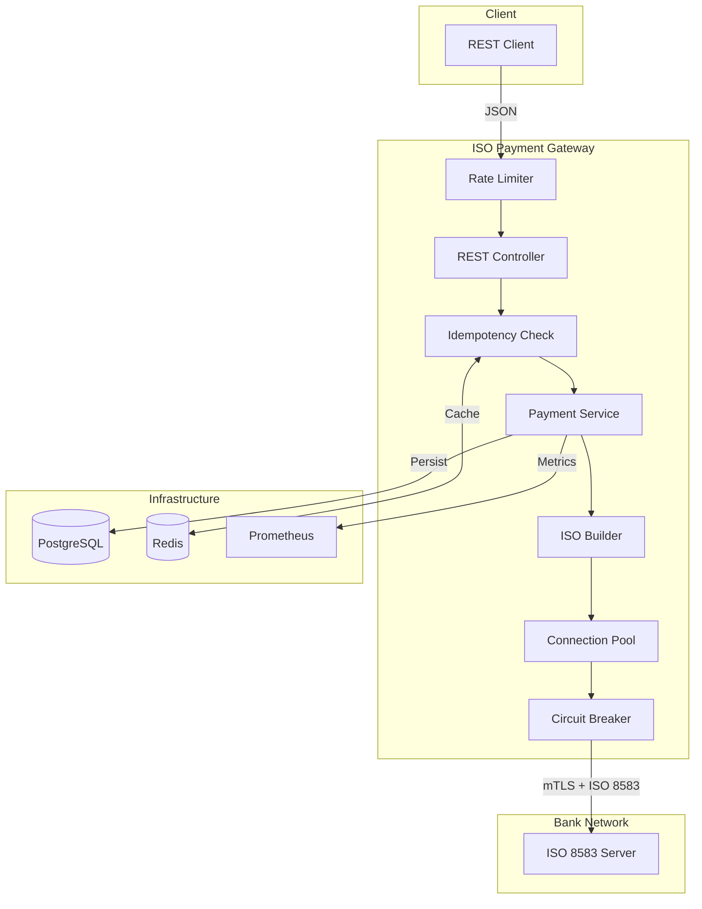

# ISO 8583 Payment Gateway

[](https://github.com)
[](https://openjdk.org)
[](https://spring.io/projects/spring-boot)
[](LICENSE)

High-performance Payment Gateway bridging REST/JSON APIs with legacy banking systems using ISO 8583 over TCP/Binary. Production-ready with enterprise-grade security, observability, and resilience patterns.

## Architecture



## Key Features

| Category | Feature | Implementation |
|----------|---------|----------------|
| **Resilience** | Circuit Breaker | Resilience4j with auto-recovery |
| **Resilience** | Connection Pooling | Apache Commons Pool2 |
| **Resilience** | Idempotency | Redis-based duplicate prevention |
| **Resilience** | Graceful Shutdown | Active transaction completion |
| **Resilience** | Heartbeat Monitor | Bank connection health check |
| **Resilience** | Async Processing | Non-blocking notifications |
| **Security** | mTLS | Mutual TLS with X.509 certificates |
| **Security** | Encryption at Rest | AES-256-GCM for sensitive data |
| **Security** | Log Masking | PAN regex replacement |
| **Security** | Rate Limiting | Bucket4j per-IP throttling |
| **Security** | Container Hardening | Non-root user execution |
| **Observability** | Structured Logging | MDC correlation IDs |
| **Observability** | Metrics | Prometheus + Micrometer |
| **Observability** | Health Checks | Kubernetes-ready probes |
| **Observability** | Distributed Tracing | OpenTelemetry integration |
| **DevOps** | CI Pipeline | GitHub Actions with tests |
| **DevOps** | Docker Compose | Full stack with Prometheus/Grafana |
| **Testing** | Unit Tests | JUnit 5 + Mockito |
| **Testing** | Integration Tests | Testcontainers |
| **Testing** | Mutation Testing | Pitest coverage |

## Tech Stack

| Component | Technology | Purpose |
|-----------|------------|---------|
| Runtime | Java 17 | LTS with modern features |
| Framework | Spring Boot 3.2 | Production-grade foundation |
| ISO Protocol | j8583 1.17 | Message parsing/building |
| Database | PostgreSQL 15 | ACID-compliant persistence |
| Cache | Redis 7 | Idempotency keys |
| Resilience | Resilience4j 2.2 | Circuit breaker pattern |
| Rate Limiting | Bucket4j 8.7 | Token bucket algorithm |
| Migrations | Flyway 9.x | Version-controlled schema |
| Metrics | Micrometer + Prometheus | Observability |
| Tracing | OpenTelemetry | Distributed tracing |
| Testing | JUnit 5 + Testcontainers | Integration testing |
| Mutation | Pitest 1.15 | Test quality verification |
| Security | OWASP Dependency Check | CVE scanning |
| CI/CD | GitHub Actions | Automated pipelines |

## Technical Decisions

### Why Connection Pooling?
TCP handshake to banking networks takes 50-100ms. Connection pooling maintains warm connections, reducing latency to sub-millisecond for subsequent requests. Critical for high-throughput scenarios.

### Why mTLS?
PCI-DSS mandates encrypted channels for cardholder data. Mutual TLS provides bidirectional authentication, ensuring both gateway and bank verify each other's identity.

### Why Circuit Breaker?
Bank systems may become unavailable. Without circuit breakers, threads block waiting for timeouts, exhausting the thread pool. Circuit breaker fails fast, preserving system resources.

### Why Idempotency?
Network issues cause retry scenarios. Without idempotency, a payment could be processed multiple times. Redis-based idempotency ensures exactly-once processing semantics.

### Why AES-256-GCM?
Card data at rest requires encryption per PCI-DSS. AES-256-GCM provides authenticated encryption, preventing both eavesdropping and tampering.

## Quick Start

### Prerequisites

- Docker & Docker Compose
- Java 17 (for local development)

### Run with Docker Compose

```bash
docker-compose up -d
```

Services:
- **API**: http://localhost:8080
- **Swagger UI**: http://localhost:8080/swagger-ui.html
- **Prometheus**: http://localhost:9090
- **Grafana**: http://localhost:3000 (admin/admin)

### Run Locally

```bash
# Start infrastructure
docker-compose up -d postgres redis

# Run application
./mvnw spring-boot:run
```

## API Reference

### Authorize Payment

```bash
curl -X POST http://localhost:8080/api/v1/payments/authorize \
  -H "Content-Type: application/json" \
  -H "Idempotency-Key: unique-request-id" \
  -d '{
    "cardNumber": "4111111111111111",
    "expirationDate": "1225",
    "amount": 100.00,
    "merchantId": "MERCHANT001",
    "terminalId": "TERM001"
  }'
```

### Health Check

```bash
curl http://localhost:8080/actuator/health
```

### Metrics

```bash
curl http://localhost:8080/actuator/prometheus
```

## Configuration

| Property | Default | Description |
|----------|---------|-------------|
| `gateway.bank.host` | localhost | Bank ISO server host |
| `gateway.bank.port` | 9999 | Bank ISO server port |
| `gateway.pool.max-total` | 20 | Max pooled connections |
| `gateway.ssl.enabled` | false | Enable mTLS |
| `gateway.ratelimit.requests-per-second` | 100 | Rate limit per IP |
| `resilience4j.circuitbreaker.instances.bankConnection.failureRateThreshold` | 50 | Circuit breaker threshold |

## Monitoring

### Key Metrics

| Metric | Description |
|--------|-------------|
| `gateway.payment.processed` | Payment count by status |
| `gateway.tcp.request.duration` | Bank communication latency |
| `gateway.connection.pool.active` | Active pool connections |
| `gateway.heartbeat.healthy` | Bank connection health |

### Grafana Dashboard

Pre-configured dashboard available at http://localhost:3000 after `docker-compose up`.

## Testing

```bash
# Unit tests
./mvnw test

# Integration tests (requires Docker)
./mvnw verify

# Mutation testing
./mvnw org.pitest:pitest-maven:mutationCoverage

# Security scan
./mvnw dependency-check:check
```

## Project Structure

```
src/main/java/com/example/isogateway/
├── api/
│   ├── controller/       # REST endpoints
│   └── dto/              # Request/Response DTOs
├── config/               # Spring configuration
├── core/
│   ├── domain/           # JPA entities + converters
│   ├── iso/              # ISO 8583 message factory
│   └── repository/       # Data access
├── exception/            # Global error handling
├── infrastructure/
│   └── tcp/client/       # Pooled TCP client + Circuit Breaker
├── service/              # Business logic
└── util/                 # Utilities
```

## Security

- Card numbers encrypted at rest (AES-256-GCM)
- Logs automatically mask PANs
- Rate limiting prevents abuse
- Non-root container execution
- OWASP dependency scanning in CI

## License

MIT
